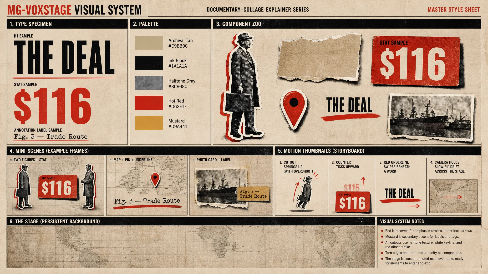
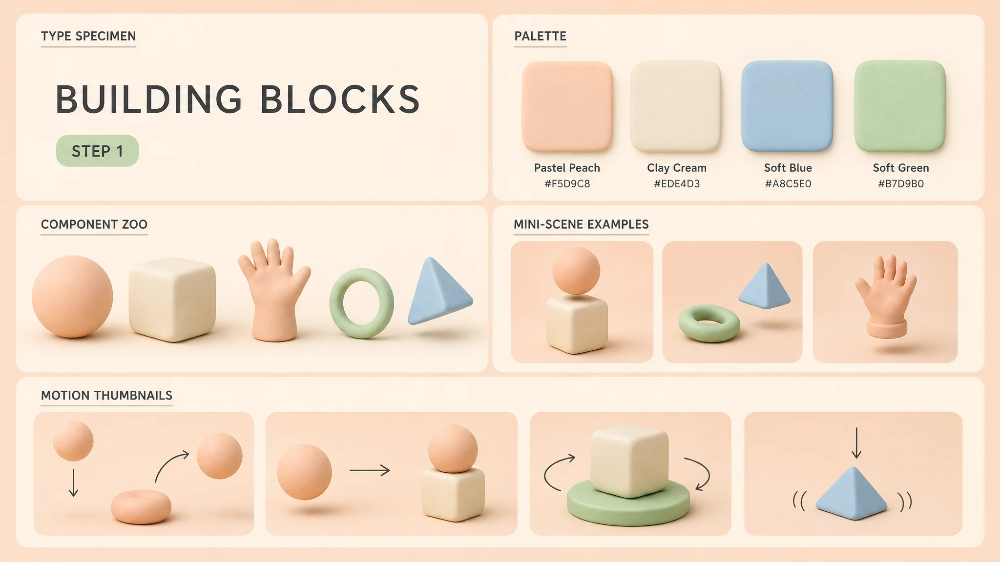
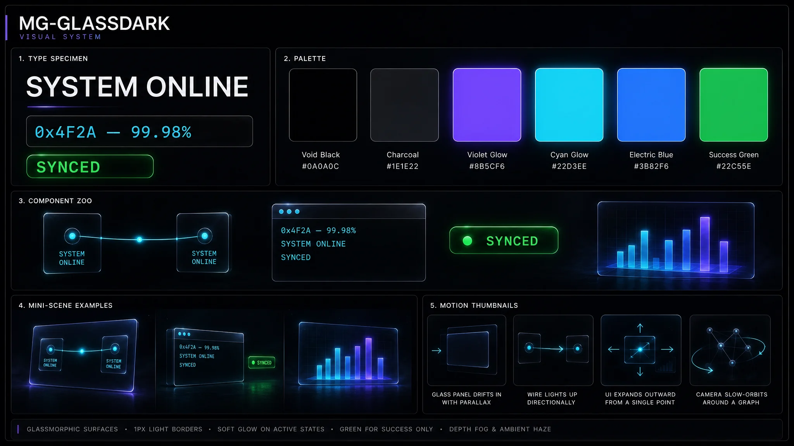
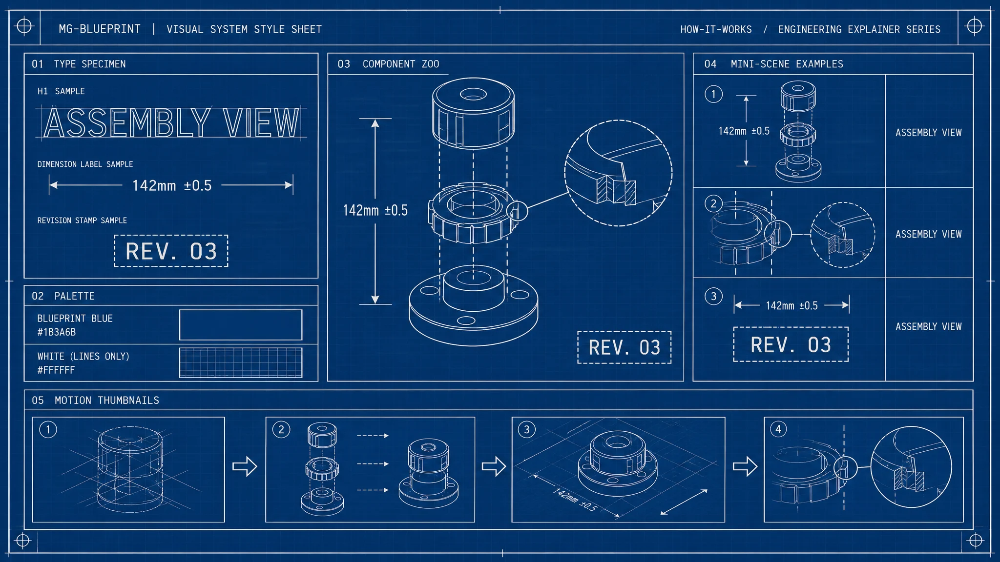

# Leslie-vox-style.skill

An open-source, bilingual (中文 / English) Codex skill collection for documentary
ideation, VOXSTAGE editorial paper-collage image prompts, and locked-frame animation.

## Style reference boards

| MG-VOXSTAGE | MG-SOFT3D |
| --- | --- |
|  |  |

| MG-GLASSDARK | MG-BLUEPRINT |
| --- | --- |
|  |  |

All four boards are embedded in every packaged skill under `assets/`, so each
installation remains self-contained. MG-VOXSTAGE is the default; name another
board explicitly to select it for a shot.

## Skills

1. `documentary-narrative-engine` - develop documentary topics, structure,
   narration, VOXSTAGE visual beats, and thumbnail concepts.
2. `documentary-image-prompts` - turn narration into a timed beat table and
   one editorial collage image prompt per beat.
3. `editorial-paper-collage-animation` - animate a supplied final frame as a
   ten-second handcrafted paper-collage assembly.

## Install

Copy any folder from `skills/` into your Codex skills directory:

```bash
cp -R skills/documentary-narrative-engine ~/.codex/skills/
```

Packaged `.skill` archives are available in `packages/`. Each skill provides
Chinese instructions in `SKILL.md` and a full English counterpart in
`SKILL.en.md`; the Chinese entry automatically directs English requests to the
English workflow.

## License

MIT
